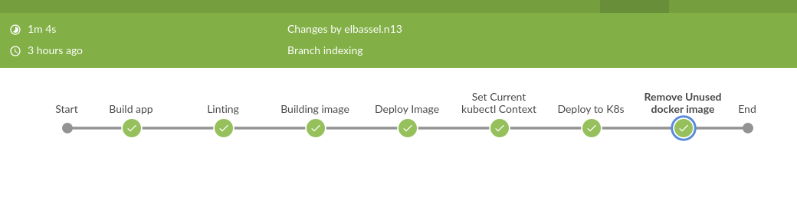
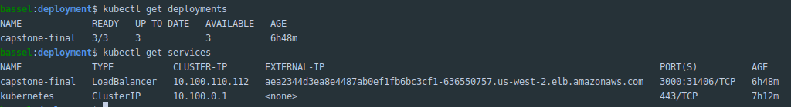
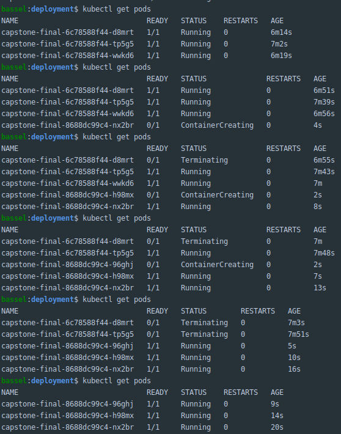

# Capstone- Cloud DevOps
URL: http://aea2344d3ea8e4487ab0ef1fb6bc3cf1-636550757.us-west-2.elb.amazonaws.com:3000/

## Piplelines:
Passed successfully


## Docker Hub:



## Deployment - Service


## Strategy:
Rollingout:
``` 
strategy:
    type: RollingUpdate
    rollingUpdate:
       maxSurge: 25%
       maxUnavailable: 25%
```

